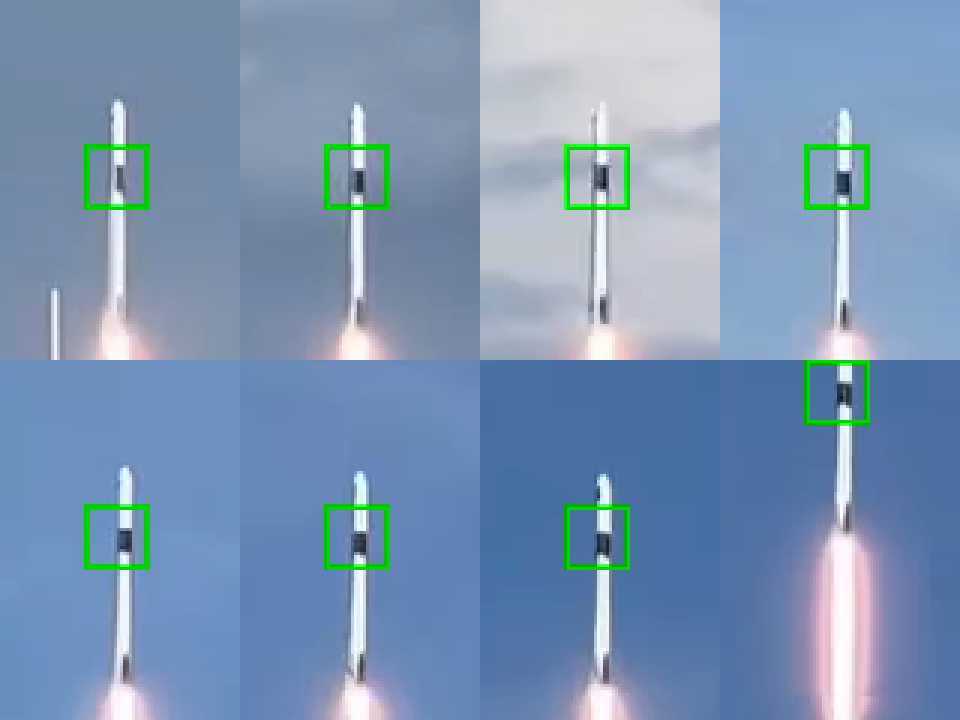

# Native-pixel autotracking benchmark

## Objective and scope
Match or exceed Tracker Video Analysis in useful continuity and positional
accuracy. Current evidence establishes a substantial improvement on the supplied
rocket, not superiority over Tracker. Matching Tracker coordinates and browser
acceptance are still pending. No browser automation or deployment was performed.

## Reproducible input
- File: `../prototypes/test-videos/spaceX.mp4` from physics-app. The video lives
  outside the Git repository and is not committed.
- SHA-256: `e986bc838a3ef8dd12b32deff90bd2bbb63e063b8d0125dc80f6c52fffd637d4`
- Decoded size 1080×1920, 30 fps, 1111 video frames, duration about 37.03 seconds.
- FFmpeg n9.0.1 used offline. Browser decoding/resampling can differ.
- Seed frame 360 (12 seconds), native coordinates (545.5,1381.5), black band.

## Baseline and outcomes

| Replay | Last accepted frame | First rejected frame | Result |
|---|---:|---:|---|
| Old 11-analysis-pixel template, old defaults | 469 | 470 (15.6667 s) | Original-keyframe correlation .6442 rejected an otherwise strong candidate |
| Native 21-pixel circular template, current defaults | 890 | 891 (29.7000 s) | No reselection through clouds; complete template reaches upper edge |
| Start at frame 420 with offset seed (548.5,1308.5) | 891 | 892 | No reselection to upper edge |

Default native run has 531 accepted points including seed. Matching median about
20 ms/frame, excluding decoding and UI work. Spot checks at frames 360,470,540,
630,720,810,870,890 keep the black band inside the tracking region. These are visual
spot checks, not independent subpixel ground truth. Annotated contact sheet:



Read left to right, top row then bottom row. Crops are enlarged for inspection;
the green square encloses the circular template. Final crop is clipped at the
video's top edge. A summary with sampled coordinates is in rocket-benchmark.json.

The earlier falling-ball video was also replayed from 9.45 s with native seed
(370.5,402.5), diameter 51, radius 100, other defaults. Eleven points were accepted;
first rejection at 9.8167 s as the ball leaves the frame. No wall/ruler point was
accepted. Large-region coarse-to-fine refinement reproduced the exhaustive run's
accepted coordinates exactly, reducing median match time from 646 to 55 ms.

## Commands (from physics-app)

```bash
node scripts/replay-rocket-baseline.mjs ../prototypes/test-videos/spaceX.mp4
npm run benchmark:rocket
node scripts/replay-rocket.mjs ../prototypes/test-videos/20260201_162430.mp4 /tmp/ball-replay.json '{"size":51,"radius":100}' '{"start":9.45,"x":370.5,"y":402.5,"originX":150,"width":500}'
```

The replay decodes a fixed strip containing the known trajectory, then uses the
same moving native-pixel ROI and matcher as the app. It aborts if the moving ROI
leaves that strip. The app crops directly from the decoded original video.
`benchmark:rocket` asserts continuity to the upper edge, stopping near exit,
remaining in the observed rocket column, and no discontinuous jumps. Passing
those checks does not establish per-frame accuracy. JSON output defaults to /tmp.

## Validation and remaining owner checks

All 25 tests, lint, production build and whitespace checks pass. The rocket
benchmark assertions pass. Production output excludes the development tracking
capture code. Existing Browserslist/chunk-size warnings remain.
- Automated synthetic coverage: native crop offsets, moving background brightness,
  duplicates/ambiguity, disappearing targets, resize preservation, coarse-to-fine
  displacement, adaptation without learning flat backgrounds.
- Repeat the rocket in the local browser with 30 fps and defaults. Select the black
  band near 12 s. Inspect measured points through the cloud crossing and frame exit.
- Try nearby seed positions, different template diameters and other videos.
- Confirm pause, live sliders, reselect, Clear Data, object/FPS/media switches,
  scale/origin/zoom and project persistence still behave correctly.
- Compare the same frames and physical feature with Tracker's exported positions
  to quantify error and validate the same-or-better objective.

Native pixel diameter is not interchangeable with the old reduced-image diameter.
The displayed match percentage now means normalized structural correlation,
not the old RGB score or a probability. Default evolution 20%, tether 5%, cutoff 75%.
Workers, acceleration prediction, arbitrary ellipse dimensions and retrying a
failed frame remain future increments. Screen-canvas high-DPI changes are separate.
